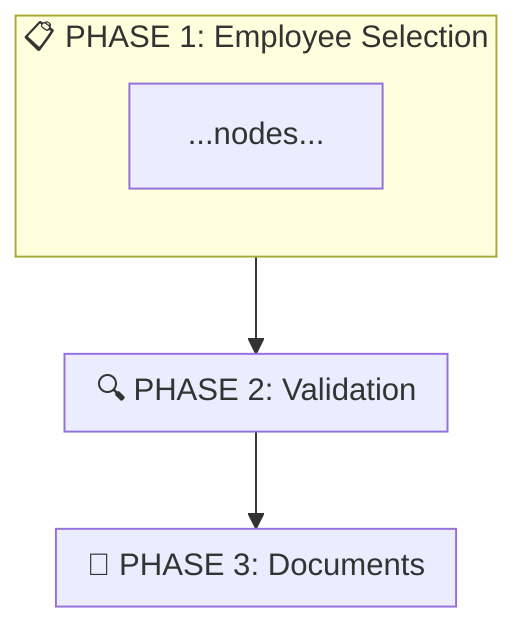
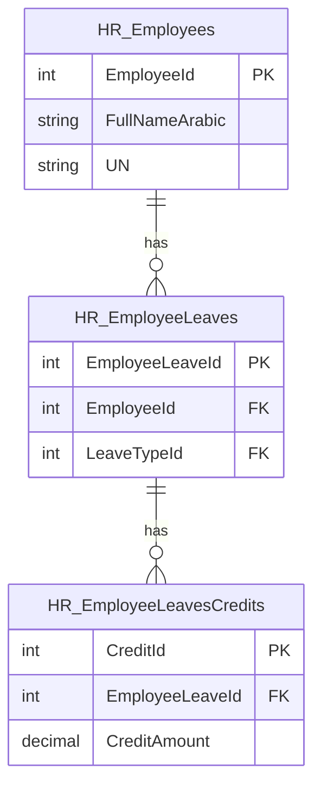
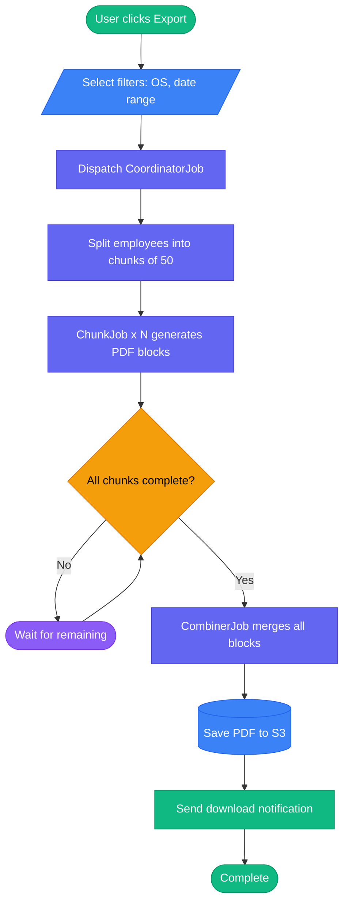
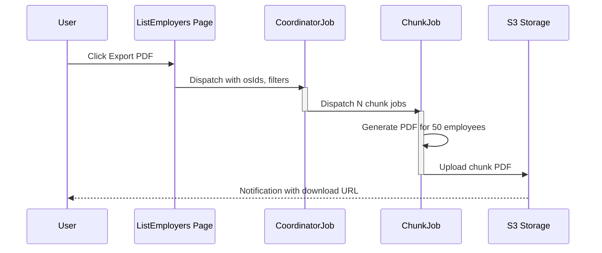
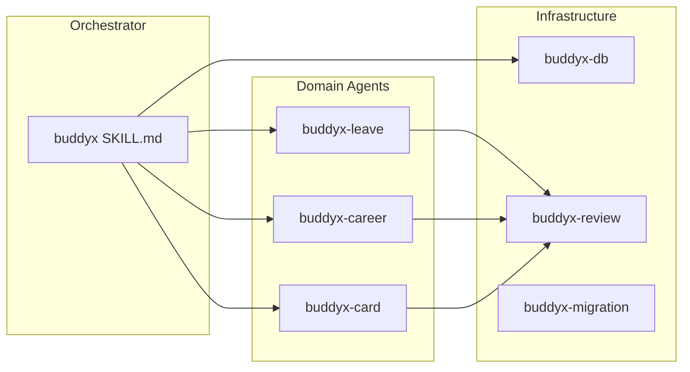
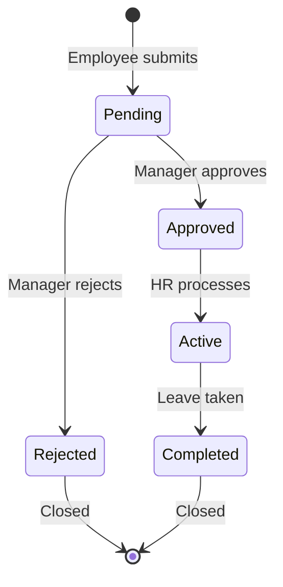

# Diagram Generator

Generate standalone HTML files with interactive Mermaid.js diagrams from codebase analysis.

## Trigger

User says `diagram: <description>`. Examples:
- `diagram: DB tables for leave module`
- `diagram: task flow for PDF export`
- `diagram: job pipeline for bulk credentials`
- `diagram: agent architecture`
- `diagram: leave approval status workflow`

## Process

### Step 1: Parse Request

Extract from the description:
- **Diagram type**: Match against the table below
- **Scope**: Which module, tables, files, or system to diagram

| Keywords | Diagram Type | Renderer |
|----------|-------------|----------|
| DB, tables, schema, model, relationship, ER, dbml | DB Diagram (dbdiagram-style) | Custom HTML table cards + DBML |
| flow, task, process, steps, page, decision | Flowchart | Mermaid `graph TD` |
| job, pipeline, queue, sequence, API, request | Sequence Diagram | Mermaid `sequenceDiagram` |
| architecture, module, agent, system, dependency | Architecture | Mermaid `graph LR` |
| status, state, approval, workflow, lifecycle | State Diagram | Mermaid `stateDiagram-v2` |

**DB Diagram** uses a special HTML template (not Mermaid). See "DB Diagram Template" section below.

### Step 2: Gather Data

Based on diagram type, read the relevant sources:

**ER Diagram:**
1. Use `mcp__laravel-boost__database-schema` tool to get table columns and types
2. Read model files to find `belongsTo`, `hasMany`, `morphMany` relationships
3. Extract primary keys, foreign keys, and relationship cardinality

**Flowchart:**
1. Read the controller/action/page that initiates the flow
2. Read any jobs, services, or helpers called in the chain
3. Trace the execution path from trigger to result

**Sequence Diagram:**
1. Read the coordinator/chunk/combiner job files
2. Identify actors: User, Page, Job, Queue, Storage, Notification
3. Map the message flow between actors

**Architecture:**
1. Read `.claude/agents/*.md` for agent system diagrams
2. Read `app/` directory structure for module diagrams
3. Identify dependencies between components

**State Diagram:**
1. Find the enum or constants that define states
2. Read model observers/events that trigger transitions
3. Map transitions with conditions

### Step 3: Generate Mermaid Code

**General rules:**
- Keep node labels short (max 30 chars)
- Use meaningful IDs (not A, B, C — use `userClick`, `dispatchJob`, etc.)
- Flow direction: top-to-bottom (`graph TD`) for processes, left-to-right (`graph LR`) for architecture
- Label every decision branch (Yes/No, or specific outcomes)

**Flowchart symbols (ANSI/ISO standard — MUST follow):**

| Symbol | Mermaid Syntax | Meaning | Use For |
|--------|---------------|---------|---------|
| Rounded rectangle | `id([Label])` | **Start/End** (terminal) | First and last step |
| Rectangle | `id[Label]` | **Process** (action) | Steps, tasks, operations |
| Diamond | `id{Label}` | **Decision** (branch) | Yes/No questions, conditions |
| Parallelogram | `id[/Label/]` | **Input/Output** (data) | User input, form data, API response |
| Cylinder | `id[(Label)]` | **Database** (stored data) | DB queries, storage |
| Stadium | `id([Label])` | **Terminal** | Start, End, Complete |
| Hexagon | `id{{Label}}` | **Preparation** | Setup, initialization |
| Subroutine | `id[[Label]]` | **Predefined process** | Reusable sub-flow, external system |

**Color coding (use `style` or `classDef`):**

```mermaid
classDef start fill:#10b981,stroke:#059669,color:#fff
classDef process fill:#6366f1,stroke:#4f46e5,color:#fff
classDef decision fill:#f59e0b,stroke:#d97706,color:#000
classDef danger fill:#ef4444,stroke:#dc2626,color:#fff
classDef success fill:#10b981,stroke:#059669,color:#fff
classDef info fill:#3b82f6,stroke:#2563eb,color:#fff
classDef waiting fill:#8b5cf6,stroke:#7c3aed,color:#fff
```

Apply: `nodeId:::start`, `nodeId:::danger`, etc.

**Flowchart-specific rules:**
- Every flowchart MUST start with a rounded terminal and end with one
- Every decision diamond MUST have 2+ labeled exit paths
- Use `subgraph` to group related phases — this is KEY for large flows:



- Max ~25 nodes per diagram — split into sub-flows if larger
- Avoid crossing lines — use `subgraph` or rearrange nodes
- For large flows (>15 nodes), ALWAYS group into subgraph phases
- Add emoji prefix to subgraph labels for quick visual scanning
- Use `:::danger` for error/block paths, `:::success` for happy paths — creates instant visual hierarchy

**For ER/DB diagrams:** show PK, FK, and column types
**For sequence diagrams:** use `activate`/`deactivate` for long operations

### Step 4: Generate HTML File

Use this exact HTML template. Replace `{{TITLE}}`, `{{DESCRIPTION}}`, `{{DATE}}`, and `{{MERMAID_CODE}}`:

```html
<!DOCTYPE html>
<html lang="en">
<head>
<meta charset="UTF-8">
<meta name="viewport" content="width=device-width, initial-scale=1.0">
<title>{{TITLE}}</title>
<style>
  * { margin: 0; padding: 0; box-sizing: border-box; }
  :root { --bg: #ffffff; --text: #1a1a2e; --card: #f8f9fa; --border: #e0e0e0; --accent: #6366f1; }
  [data-theme="dark"] { --bg: #0f172a; --text: #e2e8f0; --card: #1e293b; --border: #334155; --accent: #818cf8; }
  body { font-family: -apple-system, BlinkMacSystemFont, 'Segoe UI', sans-serif; background: var(--bg); color: var(--text); min-height: 100vh; }
  .header { padding: 20px 32px; border-bottom: 1px solid var(--border); display: flex; justify-content: space-between; align-items: center; flex-wrap: wrap; gap: 12px; }
  .header h1 { font-size: 1.5rem; font-weight: 600; }
  .header .meta { font-size: 0.85rem; opacity: 0.7; }
  .controls { display: flex; gap: 8px; align-items: center; }
  .controls button { padding: 6px 14px; border: 1px solid var(--border); border-radius: 6px; background: var(--card); color: var(--text); cursor: pointer; font-size: 0.85rem; transition: border-color 0.2s; }
  .controls button:hover { border-color: var(--accent); }
  .diagram-container { width: 100%; height: calc(100vh - 140px); overflow: scroll; position: relative; }
  .diagram-wrapper { transform-origin: 0 0; padding: 40px; display: inline-block; min-width: 100%; min-height: 100%; }
  /* Professional flowchart node styling */
  .mermaid .node rect, .mermaid .node polygon, .mermaid .node circle { rx: 8; ry: 8; filter: drop-shadow(0 2px 4px rgba(0,0,0,0.1)); }
  .mermaid .edgePath .path { stroke-width: 2; }
  .mermaid .edgeLabel { font-size: 12px; background: var(--bg); padding: 2px 6px; border-radius: 4px; }
  .mermaid .cluster rect { rx: 12; ry: 12; stroke-width: 2; stroke-dasharray: 8; fill: var(--card); opacity: 0.5; }
  .mermaid .cluster .nodeLabel { font-weight: 600; font-size: 13px; letter-spacing: 0.5px; text-transform: uppercase; }
  .mermaid text { font-family: -apple-system, BlinkMacSystemFont, 'Segoe UI', sans-serif !important; }
  .description { padding: 12px 32px; background: var(--card); border-bottom: 1px solid var(--border); font-size: 0.9rem; }
  .zoom-level { font-size: 0.8rem; opacity: 0.6; min-width: 45px; text-align: center; }
  @media print { .header, .controls, .description { position: static; } .diagram-container { height: auto; overflow: visible; padding: 16px; } .controls button { display: none; } .header { border: none; padding: 10px 16px; } h1 { font-size: 1.2rem; } .diagram-wrapper { transform: none !important; } }
</style>
</head>
<body>
<div class="header">
  <div>
    <h1>{{TITLE}}</h1>
    <div class="meta">Generated: {{DATE}} | Myapp</div>
  </div>
  <div class="controls">
    <button onclick="zoomOut()">−</button>
    <span class="zoom-level" id="zoomLevel">100%</span>
    <button onclick="zoomIn()">+</button>
    <button onclick="resetZoom()">Reset</button>
    <button onclick="fitToScreen()">Fit</button>
    <button onclick="toggleTheme()">🌓 Theme</button>
    <button onclick="copyMermaid()">📋 Copy</button>
    <button onclick="window.print()">🖨 Print</button>
  </div>
</div>
<div class="description">{{DESCRIPTION}}</div>
<div class="diagram-container" id="container">
  <div class="diagram-wrapper" id="wrapper">
    <pre class="mermaid">
{{MERMAID_CODE}}
    </pre>
  </div>
</div>
<div class="sample-modal" id="sampleModal" style="display:none;position:fixed;top:0;left:0;width:100%;height:100%;background:rgba(0,0,0,0.6);z-index:200;justify-content:center;align-items:center;">
  <div style="background:var(--card);border:1px solid var(--border);border-radius:10px;max-width:70vw;max-height:70vh;overflow:auto;box-shadow:0 12px 40px rgba(0,0,0,0.3);">
    <div style="padding:14px 20px;border-bottom:1px solid var(--border);display:flex;justify-content:space-between;align-items:center;font-weight:600;"><span id="sampleTitle">Details</span><button onclick="document.getElementById('sampleModal').style.display='none'" style="border:none;background:none;color:var(--text);cursor:pointer;font-size:1.3rem;">✕</button></div>
    <div id="sampleBody" style="padding:0;"></div>
  </div>
</div>
<script type="module">
  import mermaid from 'https://cdn.jsdelivr.net/npm/mermaid@11/dist/mermaid.esm.min.mjs';
  const isDark = document.documentElement.getAttribute('data-theme') === 'dark';
  mermaid.initialize({
    startOnLoad: true,
    theme: isDark ? 'dark' : 'default',
    securityLevel: 'loose',
    er: { useMaxWidth: false },
    flowchart: {
      useMaxWidth: false,
      htmlLabels: true,
      nodeSpacing: 80,
      rankSpacing: 60,
      curve: 'cardinal',
      padding: 20,
      diagramPadding: 30
    },
    sequence: { useMaxWidth: false },
    themeVariables: isDark ? {
      primaryColor: '#6366f1',
      primaryTextColor: '#fff',
      primaryBorderColor: '#4f46e5',
      lineColor: '#64748b',
      secondaryColor: '#1e293b',
      tertiaryColor: '#0f172a',
      fontSize: '14px',
      fontFamily: '-apple-system, BlinkMacSystemFont, Segoe UI, sans-serif'
    } : {
      primaryColor: '#6366f1',
      primaryTextColor: '#fff',
      primaryBorderColor: '#4f46e5',
      lineColor: '#94a3b8',
      secondaryColor: '#f1f5f9',
      tertiaryColor: '#ffffff',
      fontSize: '14px',
      fontFamily: '-apple-system, BlinkMacSystemFont, Segoe UI, sans-serif'
    }
  });
</script>
<script>
  var scale = 1;
  var wrapper = document.getElementById('wrapper');
  var container = document.getElementById('container');
  var zoomLabel = document.getElementById('zoomLevel');
  var svgEl = null;
  var origW = 0, origH = 0;

  function initSvgSize() {
    svgEl = wrapper.querySelector('svg');
    if (svgEl) { origW = svgEl.scrollWidth || svgEl.getBoundingClientRect().width; origH = svgEl.scrollHeight || svgEl.getBoundingClientRect().height; }
  }

  function updateZoom() {
    wrapper.style.transform = 'scale(' + scale + ')';
    // Update wrapper size so scroll area matches scaled content
    if (origW) { wrapper.style.width = (origW * scale + 64) + 'px'; wrapper.style.height = (origH * scale + 64) + 'px'; }
    zoomLabel.textContent = Math.round(scale * 100) + '%';
  }
  function zoomIn() { scale = Math.min(scale + 0.1, 3); updateZoom(); }
  function zoomOut() { scale = Math.max(scale - 0.1, 0.2); updateZoom(); }
  function resetZoom() { scale = 1; updateZoom(); }
  function fitToScreen() {
    if (!origW) return;
    var cw = container.clientWidth - 40, ch = container.clientHeight - 40;
    scale = Math.min(cw / origW, ch / origH, 1);
    updateZoom();
  }

  // Ctrl+wheel = zoom, normal wheel = scroll (default browser behavior)
  container.addEventListener('wheel', function(e) {
    if (e.ctrlKey || e.metaKey) { e.preventDefault(); if (e.deltaY < 0) zoomIn(); else zoomOut(); }
    // Without ctrl: normal scroll — don't prevent default
  }, { passive: false });

  // Middle-click drag to pan
  var isDragging = false, startX, startY, scrollLeft, scrollTop;
  container.addEventListener('mousedown', function(e) {
    if (e.button === 1 || (e.button === 0 && e.altKey)) { // middle-click or alt+click
      e.preventDefault(); isDragging = true;
      startX = e.pageX; startY = e.pageY;
      scrollLeft = container.scrollLeft; scrollTop = container.scrollTop;
      container.style.cursor = 'grabbing';
    }
  });
  document.addEventListener('mouseup', function() { isDragging = false; container.style.cursor = ''; });
  document.addEventListener('mousemove', function(e) {
    if (!isDragging) return; e.preventDefault();
    container.scrollLeft = scrollLeft - (e.pageX - startX);
    container.scrollTop = scrollTop - (e.pageY - startY);
  });

  // Init sizes after mermaid renders
  setTimeout(initSvgSize, 500);

  function toggleTheme() {
    var html = document.documentElement;
    var current = html.getAttribute('data-theme');
    var next = current === 'dark' ? '' : 'dark';
    html.setAttribute('data-theme', next);
    localStorage.setItem('diagram-theme', next);
    location.reload(); // Mermaid theme needs full reload
  }

  function copyMermaid() {
    var pre = document.querySelector('pre.mermaid');
    var code = pre ? pre.textContent.trim() : '';
    if (!code) { var svg = wrapper.querySelector('svg'); code = svg ? svg.outerHTML : ''; }
    navigator.clipboard.writeText(code).then(function() {
      var btns = document.querySelectorAll('.controls button');
      btns.forEach(function(b) { if (b.textContent.includes('Copy')) { b.textContent = '✅ Copied!'; setTimeout(function() { b.textContent = '📋 Copy'; }, 1500); } });
    });
  }

  // Restore saved theme
  var saved = localStorage.getItem('diagram-theme');
  if (saved) document.documentElement.setAttribute('data-theme', saved);
</script>
</body>
</html>
```

### Step 5: Save and Open

1. Create output directory if needed: `mkdir -p docs/diagrams`
2. Save to `docs/diagrams/YYYY-MM-DD-<slug>.html` (slug from title, lowercase kebab-case)
3. Open in browser: `xdg-open docs/diagrams/<filename>.html` (Linux) or `open` (macOS)
4. Tell user the file path and how to reopen it

## Diagram Type Examples

### ER Diagram


### Flowchart (with proper symbols and colors)


### Sequence Diagram


### Architecture


### State Diagram


## DB Diagram Template (dbdiagram.io style)

For DB/ER/table diagrams, use this HTML template instead of the Mermaid template. It renders table cards with colored headers, column types, PK/FK badges, and relationship lines — matching the dbdiagram.io visual style.

### Crow's Foot Notation (MUST follow for relationship lines)

| Symbol | Marker | Meaning |
|--------|--------|---------|
| `\|` (bar) | One, mandatory | Exactly one |
| `○` (circle) | Zero, optional | Zero or one |
| `<` (crow's foot) | Many | One or more |
| `○<` | Zero-to-many | Zero or more (most common FK) |
| `\|\|——\|<` | One-to-many | One parent, many children |
| `\|\|——\|\|` | One-to-one | One parent, one child |

**The `data-cardinality` attribute on FK rows controls this:**
- `data-cardinality="1:N"` → bar on PK side, crow's foot on FK side (default)
- `data-cardinality="1:1"` → bar on both sides
- `data-cardinality="N:M"` → crow's foot on both sides (pivot table)

### DB Diagram Best Practices
- Entity names in **singular** (HR_Employee**Leave**, not Leaves)
- Show optionality explicitly: required FK = bar `|`, optional FK = circle `○`
- Resolve M:N with a pivot/associative table — never draw M:N directly
- Group related tables with section headers (CONFIGURATION, TRANSACTIONAL, etc.)
- Max 12 tables per diagram — split into sub-diagrams if larger

Replace `{{TITLE}}`, `{{DATE}}`, `{{DESCRIPTION}}`, `{{TABLE_CARDS}}`, and `{{DBML_CODE}}`:

### Table Card HTML Pattern

For each table, generate a card with `data-table` attribute. FK rows get `data-ref` pointing to the target table:

```html
<div class="table-card" data-table="HR_Employees" data-sample='[{"EmployeeId":1,"FullNameArabic":"أحمد محمد","UN":"EMP001","DepartmentId":5},{"EmployeeId":2,"FullNameArabic":"سارة علي","UN":"EMP002","DepartmentId":3}]'>
  <div class="table-header">HR_Employees</div>
  <div class="table-row"><span class="col-name">EmployeeId <span class="badge pk">PK</span></span><span class="col-type">integer</span></div>
  <div class="table-row"><span class="col-name">FullNameArabic</span><span class="col-type">varchar</span></div>
  <div class="table-row"><span class="col-name">UN</span><span class="col-type">varchar</span></div>
  <div class="table-row" data-ref="CONST_OrganizationalStructures"><span class="col-name">DepartmentId <span class="badge fk">FK</span></span><span class="col-type">integer</span><span class="ref-label">→ CONST_OrganizationalStructures.Id</span></div>
</div>
```

**IMPORTANT:**
- Every FK row MUST have `data-ref="TargetTableName"` — this is how the JS draws relationship lines
- Add `<span class="ref-label">` showing the target reference
- Add `data-sample` JSON attribute with 3-5 sample rows from the table (use `mcp__laravel-boost__database-query` to fetch: `SELECT * FROM "TableName" LIMIT 5`)
- If query fails or table is empty, omit `data-sample` (click will show "No sample data")
- Clicking a table header opens a modal showing the sample data

### DB Diagram HTML Template

```html
<!DOCTYPE html>
<html lang="en">
<head>
<meta charset="UTF-8">
<meta name="viewport" content="width=device-width, initial-scale=1.0">
<title>{{TITLE}}</title>
<style>
  * { margin: 0; padding: 0; box-sizing: border-box; }
  :root { --bg: #1a1a2e; --text: #e2e8f0; --card-bg: #252542; --header-bg: #6366f1; --header-text: #fff; --border: #334155; --row-hover: #2d2d4a; --pk: #f59e0b; --fk: #3b82f6; --nn: #ef4444; }
  [data-theme="light"] { --bg: #f1f5f9; --text: #1e293b; --card-bg: #ffffff; --header-bg: #6366f1; --header-text: #fff; --border: #e2e8f0; --row-hover: #f8fafc; }
  body { font-family: 'SF Mono', 'Fira Code', 'Cascadia Code', monospace; background: var(--bg); color: var(--text); min-height: 100vh; }
  .header { padding: 16px 24px; border-bottom: 1px solid var(--border); display: flex; justify-content: space-between; align-items: center; flex-wrap: wrap; gap: 10px; background: var(--card-bg); }
  .header h1 { font-size: 1.2rem; font-weight: 600; }
  .header .meta { font-size: 0.75rem; opacity: 0.6; }
  .controls { display: flex; gap: 6px; }
  .controls button { padding: 5px 12px; border: 1px solid var(--border); border-radius: 4px; background: var(--bg); color: var(--text); cursor: pointer; font-size: 0.75rem; font-family: inherit; }
  .controls button:hover { border-color: var(--header-bg); }
  .description { padding: 10px 24px; font-size: 0.8rem; opacity: 0.7; border-bottom: 1px solid var(--border); }
  .canvas { padding: 32px; overflow: auto; height: calc(100vh - 110px); cursor: grab; position: relative; }
  .canvas:active { cursor: grabbing; }
  .grid { position: relative; min-height: 800px; min-width: 1200px; transform-origin: 0 0; }
  .table-card { border: 1px solid var(--border); border-radius: 8px; overflow: hidden; background: var(--card-bg); box-shadow: 0 2px 8px rgba(0,0,0,0.15); min-width: 260px; max-width: 320px; position: absolute; cursor: grab; user-select: none; transition: box-shadow 0.15s; }
  .table-card:active { cursor: grabbing; box-shadow: 0 8px 24px rgba(0,0,0,0.3); z-index: 50; }
  .table-card.dragging { opacity: 0.9; z-index: 50; }
  .table-header { padding: 10px 14px; font-weight: 600; font-size: 0.85rem; color: var(--header-text); background: var(--header-bg); cursor: grab; }
  .table-row { padding: 6px 14px; display: flex; justify-content: space-between; align-items: center; border-top: 1px solid var(--border); font-size: 0.78rem; }
  .table-row:hover { background: var(--row-hover); }
  .col-name { display: flex; align-items: center; gap: 6px; flex: 1; }
  .col-type { opacity: 0.5; font-size: 0.72rem; white-space: nowrap; }
  .ref-label { font-size: 0.65rem; opacity: 0.4; margin-left: 4px; display: block; padding-left: 20px; margin-top: 2px; }
  .badge { font-size: 0.6rem; padding: 1px 5px; border-radius: 3px; font-weight: 700; }
  .rel-svg { position: absolute; top: 0; left: 0; width: 100%; height: 100%; pointer-events: none; z-index: 10; }
  .rel-line { stroke: var(--fk); stroke-width: 1.5; fill: none; opacity: 0.6; }
  .rel-dot { fill: var(--fk); opacity: 0.8; }
  .rel-label { font-size: 10px; fill: var(--text); opacity: 0.5; font-family: inherit; }
  .badge.pk { background: var(--pk); color: #000; }
  .badge.fk { background: var(--fk); color: #fff; }
  .badge.nn { background: var(--nn); color: #fff; }
  .dbml-panel { display: none; position: fixed; top: 0; right: 0; width: 45%; height: 100vh; background: var(--card-bg); border-left: 2px solid var(--border); z-index: 100; flex-direction: column; }
  .dbml-panel.open { display: flex; }
  .dbml-panel .panel-header { padding: 12px 16px; border-bottom: 1px solid var(--border); display: flex; justify-content: space-between; align-items: center; }
  .dbml-panel pre { flex: 1; padding: 16px; overflow: auto; font-size: 0.8rem; line-height: 1.6; white-space: pre-wrap; }
  .zoom-level { font-size: 0.7rem; opacity: 0.5; min-width: 40px; text-align: center; }
  .sample-modal { display: none; position: fixed; top: 0; left: 0; width: 100%; height: 100%; background: rgba(0,0,0,0.6); z-index: 200; justify-content: center; align-items: center; }
  .sample-modal.open { display: flex; }
  .sample-content { background: var(--card-bg); border: 1px solid var(--border); border-radius: 10px; max-width: 80vw; max-height: 80vh; overflow: auto; box-shadow: 0 12px 40px rgba(0,0,0,0.3); }
  .sample-header { padding: 14px 20px; border-bottom: 1px solid var(--border); display: flex; justify-content: space-between; align-items: center; font-weight: 600; font-size: 0.9rem; }
  .sample-close { border: none; background: none; color: var(--text); cursor: pointer; font-size: 1.3rem; padding: 4px 8px; }
  .sample-table { width: 100%; border-collapse: collapse; font-size: 0.75rem; }
  .sample-table th { padding: 8px 12px; text-align: left; border-bottom: 2px solid var(--border); font-weight: 600; white-space: nowrap; }
  .sample-table th .th-type { display: block; font-weight: 400; opacity: 0.5; font-size: 0.65rem; }
  .sample-table td { padding: 6px 12px; border-bottom: 1px solid var(--border); white-space: nowrap; }
  .sample-table tr:hover td { background: var(--row-hover); }
  .sample-table .null-val { opacity: 0.35; font-style: italic; }
  .sample-empty { padding: 24px; text-align: center; opacity: 0.5; }
  @media print { .header, .controls { position: static; } .canvas { height: auto; overflow: visible; } .dbml-panel, .sample-modal { display: none !important; } }
</style>
</head>
<body>
<div class="header">
  <div>
    <h1>{{TITLE}}</h1>
    <div class="meta">Generated: {{DATE}} | Myapp</div>
  </div>
  <div class="controls">
    <button onclick="zoomOut()">-</button>
    <span class="zoom-level" id="zl">100%</span>
    <button onclick="zoomIn()">+</button>
    <button onclick="resetZoom()">Reset</button>
    <button onclick="toggleTheme()">Theme</button>
    <button onclick="toggleDbml()">DBML</button>
    <button onclick="copyDbml()">Copy DBML</button>
    <button onclick="resetLayout()">Reset Layout</button>
    <button onclick="window.print()">Print</button>
  </div>
</div>
<div class="description">{{DESCRIPTION}}</div>
<div class="canvas" id="canvas">
  <svg class="rel-svg" id="relSvg">
    <defs>
      <marker id="crowFoot" viewBox="0 0 12 12" refX="12" refY="6" markerWidth="12" markerHeight="12" orient="auto-start-reverse">
        <path d="M0,0 L12,6 L0,12" class="rel-line" fill="none"/>
        <line x1="9" y1="0" x2="9" y2="12" class="rel-line" stroke-width="1.5"/>
      </marker>
      <marker id="oneBar" viewBox="0 0 12 12" refX="12" refY="6" markerWidth="10" markerHeight="10" orient="auto-start-reverse">
        <line x1="10" y1="1" x2="10" y2="11" class="rel-line" stroke-width="2"/>
        <line x1="6" y1="1" x2="6" y2="11" class="rel-line" stroke-width="1.5"/>
      </marker>
      <marker id="zeroOne" viewBox="0 0 16 12" refX="14" refY="6" markerWidth="14" markerHeight="12" orient="auto-start-reverse">
        <circle cx="5" cy="6" r="4" class="rel-line" fill="none" stroke-width="1.5"/>
        <line x1="13" y1="1" x2="13" y2="11" class="rel-line" stroke-width="2"/>
      </marker>
      <marker id="dotEnd" viewBox="0 0 8 8" refX="4" refY="4" markerWidth="6" markerHeight="6">
        <circle cx="4" cy="4" r="3" class="rel-dot"/>
      </marker>
    </defs>
  </svg>
  <div class="grid" id="grid">
    {{TABLE_CARDS}}
  </div>
</div>
<div class="sample-modal" id="sampleModal">
  <div class="sample-content">
    <div class="sample-header"><span id="sampleTitle">Data Sample</span><button class="sample-close" onclick="closeSample()">✕</button></div>
    <div id="sampleBody"></div>
  </div>
</div>
<div class="dbml-panel" id="dbmlPanel">
  <div class="panel-header">
    <strong>DBML Code (paste into dbdiagram.io)</strong>
    <button onclick="toggleDbml()" style="border:none;background:none;color:var(--text);cursor:pointer;font-size:1.2rem;">✕</button>
  </div>
  <pre id="dbmlCode">{{DBML_CODE}}</pre>
</div>
<script>
  var scale=1, grid=document.getElementById('grid'), zl=document.getElementById('zl');
  function uz(){grid.style.transform='scale('+scale+')';zl.textContent=Math.round(scale*100)+'%';drawRelationships();}
  function zoomIn(){scale=Math.min(scale+0.15,4);uz();}
  function zoomOut(){scale=Math.max(scale-0.15,0.2);uz();}
  function resetZoom(){scale=1;uz();}
  var c=document.getElementById('canvas');
  c.addEventListener('wheel',function(e){if(e.target.closest('.table-card'))return;e.preventDefault();e.deltaY<0?zoomIn():zoomOut();},{passive:false});
  // Canvas panning (only when not dragging a card)
  var panDrag=false,panSx,panSy,panSl,panSt;
  c.addEventListener('mousedown',function(e){if(e.target.closest('.table-card'))return;panDrag=true;panSx=e.pageX;panSy=e.pageY;panSl=c.scrollLeft;panSt=c.scrollTop;c.style.cursor='grabbing';});
  document.addEventListener('mouseup',function(){panDrag=false;c.style.cursor='grab';});
  document.addEventListener('mousemove',function(e){if(!panDrag)return;c.scrollLeft=panSl-(e.pageX-panSx);c.scrollTop=panSt-(e.pageY-panSy);});
  // Table card dragging
  var dragCard=null,dragOffX=0,dragOffY=0;
  document.addEventListener('mousedown',function(e){
    var card=e.target.closest('.table-card');if(!card)return;
    e.preventDefault();dragCard=card;card.classList.add('dragging');
    var rect=card.getBoundingClientRect(),gridRect=grid.getBoundingClientRect();
    dragOffX=e.clientX-rect.left;dragOffY=e.clientY-rect.top;
  });
  document.addEventListener('mousemove',function(e){
    if(!dragCard)return;e.preventDefault();
    var gridRect=grid.getBoundingClientRect();
    var x=(e.clientX-gridRect.left-dragOffX)/scale;
    var y=(e.clientY-gridRect.top-dragOffY)/scale;
    dragCard.style.left=Math.max(0,x)+'px';dragCard.style.top=Math.max(0,y)+'px';
    drawRelationships();
  });
  document.addEventListener('mouseup',function(){
    if(!dragCard)return;dragCard.classList.remove('dragging');
    // Save position to localStorage
    var name=dragCard.getAttribute('data-table');
    if(name){var pos=JSON.parse(localStorage.getItem('db-positions')||'{}');pos[name]={left:dragCard.style.left,top:dragCard.style.top};localStorage.setItem('db-positions',JSON.stringify(pos));}
    dragCard=null;
  });
  // Auto-layout: arrange cards in columns, measure actual heights, no overlap
  function autoLayout(){
    var cards=Array.from(document.querySelectorAll('.table-card'));
    var saved=JSON.parse(localStorage.getItem('db-positions')||'{}');
    var hasSaved=Object.keys(saved).length>0;
    // If we have saved positions, use them
    if(hasSaved){
      cards.forEach(function(card){var name=card.getAttribute('data-table');if(saved[name]){card.style.left=saved[name].left;card.style.top=saved[name].top;}});
    } else {
      // Smart layout: place in columns, measure real heights
      var gap=28,colW=320,cols=Math.min(4,Math.max(2,Math.floor((window.innerWidth-100)/colW)));
      var colTops=[];for(var i=0;i<cols;i++)colTops.push(gap);
      cards.forEach(function(card){
        // Find the shortest column to place this card in
        var minCol=0,minTop=colTops[0];
        for(var i=1;i<cols;i++){if(colTops[i]<minTop){minTop=colTops[i];minCol=i;}}
        card.style.left=(minCol*colW+gap)+'px';
        card.style.top=minTop+'px';
        // Measure actual rendered height and update column top
        colTops[minCol]=minTop+card.offsetHeight+gap;
      });
    }
    // Expand grid to fit all cards
    var maxRight=0,maxBottom=0;
    cards.forEach(function(card){maxRight=Math.max(maxRight,card.offsetLeft+card.offsetWidth+60);maxBottom=Math.max(maxBottom,card.offsetTop+card.offsetHeight+60);});
    grid.style.minWidth=Math.max(1200,maxRight)+'px';grid.style.minHeight=Math.max(800,maxBottom)+'px';
  }
  function toggleTheme(){var h=document.documentElement,t=h.getAttribute('data-theme');h.setAttribute('data-theme',t==='light'?'':'light');localStorage.setItem('db-theme',t==='light'?'':'light');}
  var s=localStorage.getItem('db-theme');if(s)document.documentElement.setAttribute('data-theme',s);
  function resetLayout(){localStorage.removeItem('db-positions');autoLayout();drawRelationships();}

  // Sample data modal — click table header to view
  document.addEventListener('click', function(e) {
    var header = e.target.closest('.table-header');
    if (!header) return;
    var card = header.closest('.table-card');
    if (!card) return;
    var name = card.getAttribute('data-table') || 'Table';
    var sampleStr = card.getAttribute('data-sample');
    document.getElementById('sampleTitle').textContent = 'Data Sample — ' + name;
    var body = document.getElementById('sampleBody');
    body.textContent = ''; // Clear safely
    if (!sampleStr) {
      var emptyDiv = document.createElement('div'); emptyDiv.className = 'sample-empty';
      emptyDiv.textContent = 'No sample data available'; body.appendChild(emptyDiv);
    } else {
      var rows = JSON.parse(sampleStr);
      if (!rows.length) {
        var emptyDiv2 = document.createElement('div'); emptyDiv2.className = 'sample-empty';
        emptyDiv2.textContent = 'Table is empty'; body.appendChild(emptyDiv2);
      } else {
        var cols = Object.keys(rows[0]);
        var tbl = document.createElement('table'); tbl.className = 'sample-table';
        var thead = document.createElement('thead'); var hrow = document.createElement('tr');
        var numTh = document.createElement('th'); numTh.textContent = '#'; hrow.appendChild(numTh);
        cols.forEach(function(c) { var th = document.createElement('th'); th.textContent = c; hrow.appendChild(th); });
        thead.appendChild(hrow); tbl.appendChild(thead);
        var tbody = document.createElement('tbody');
        rows.forEach(function(row, i) {
          var tr = document.createElement('tr');
          var numTd = document.createElement('td'); numTd.textContent = i + 1; tr.appendChild(numTd);
          cols.forEach(function(c) {
            var td = document.createElement('td');
            if (row[c] === null) { var sp = document.createElement('span'); sp.className = 'null-val'; sp.textContent = '(null)'; td.appendChild(sp); }
            else { td.textContent = String(row[c]); }
            tr.appendChild(td);
          });
          tbody.appendChild(tr);
        });
        tbl.appendChild(tbody); body.appendChild(tbl);
      }
    }
    document.getElementById('sampleModal').classList.add('open');
  });
  function closeSample() { document.getElementById('sampleModal').classList.remove('open'); }
  document.getElementById('sampleModal').addEventListener('click', function(e) { if (e.target === this) closeSample(); });
  function toggleDbml(){document.getElementById('dbmlPanel').classList.toggle('open');}
  function copyDbml(){navigator.clipboard.writeText(document.getElementById('dbmlCode').textContent).then(function(){var b=event.target;b.textContent='Copied!';setTimeout(function(){b.textContent='Copy DBML';},1500);});}

  // Draw relationship lines between FK rows and target tables
  function drawRelationships() {
    var svg = document.getElementById('relSvg');
    var canvas = document.getElementById('canvas');
    // Clear existing lines
    svg.querySelectorAll('path.rel-line-drawn, circle.rel-dot-drawn, text.rel-label').forEach(function(el) { el.remove(); });
    // Size SVG to canvas scroll area
    svg.setAttribute('width', canvas.scrollWidth);
    svg.setAttribute('height', canvas.scrollHeight);
    svg.style.width = canvas.scrollWidth + 'px';
    svg.style.height = canvas.scrollHeight + 'px';
    // Find all FK rows with data-ref
    var fkRows = document.querySelectorAll('.table-row[data-ref]');
    fkRows.forEach(function(fkRow) {
      var targetName = fkRow.getAttribute('data-ref');
      var targetCard = document.querySelector('.table-card[data-table="' + targetName + '"]');
      if (!targetCard) return;
      // Get positions relative to canvas
      var canvasRect = canvas.getBoundingClientRect();
      var fkRect = fkRow.getBoundingClientRect();
      var targetRect = targetCard.getBoundingClientRect();
      var fkX = fkRect.right - canvasRect.left + canvas.scrollLeft;
      var fkY = fkRect.top + fkRect.height / 2 - canvasRect.top + canvas.scrollTop;
      var tX = targetRect.left - canvasRect.left + canvas.scrollLeft;
      var tY = targetRect.top + 20 - canvasRect.top + canvas.scrollTop;
      // If target is to the left, connect from left side of FK
      if (tX + targetRect.width < fkRect.left - canvasRect.left + canvas.scrollLeft) {
        fkX = fkRect.left - canvasRect.left + canvas.scrollLeft;
        tX = targetRect.right - canvasRect.left + canvas.scrollLeft;
      }
      // Draw curved path
      var midX = (fkX + tX) / 2;
      // Determine cardinality markers
      var card = fkRow.getAttribute('data-cardinality') || '1:N';
      var startMarker = 'url(#oneBar)';   // PK side: always "one" by default
      var endMarker = 'url(#crowFoot)';   // FK side: "many" by default
      if (card === '1:1') { endMarker = 'url(#oneBar)'; }
      else if (card === 'N:M') { startMarker = 'url(#crowFoot)'; }
      else if (card === '0:N') { startMarker = 'url(#zeroOne)'; }
      // Draw curved path with crow's foot markers
      var path = document.createElementNS('http://www.w3.org/2000/svg', 'path');
      path.setAttribute('d', 'M' + fkX + ',' + fkY + ' C' + midX + ',' + fkY + ' ' + midX + ',' + tY + ' ' + tX + ',' + tY);
      path.setAttribute('class', 'rel-line rel-line-drawn');
      path.setAttribute('marker-start', endMarker);
      path.setAttribute('marker-end', startMarker);
      svg.appendChild(path);
    });
  }
  // Layout cards then draw lines
  window.addEventListener('load', function() { setTimeout(function(){ autoLayout(); drawRelationships(); }, 100); });
  window.addEventListener('resize', function(){ drawRelationships(); });
</script>
</body>
</html>
```

### DBML Code Pattern

For each table, generate DBML like this (user can paste into dbdiagram.io):

```
Table HR_Employees {
  EmployeeId integer [primary key]
  FullNameArabic varchar
  FullNameEnglish varchar
  UN varchar
  DepartmentId integer [not null, ref: > CONST_OrganizationalStructures.Id]
}

Table HR_EmployeeLeaves {
  EmployeeLeaveId integer [primary key]
  EmployeeId integer [not null, ref: > HR_Employees.EmployeeId]
  LeaveTypeId integer [ref: > CONST_LeaveTypes.LeaveTypeId]
  StartDate date
  EndDate date
}

Ref: HR_EmployeeLeaves.EmployeeId > HR_Employees.EmployeeId
```

### Table Header Colors

Use different colors for table prefixes to match this project's conventions:

```html
<!-- HR_ tables: indigo (default) -->
<div class="table-header">HR_Employees</div>

<!-- CONST_ tables: teal -->
<div class="table-header" style="background:#0d9488;">CONST_LeaveTypes</div>

<!-- SIS_ tables: amber -->
<div class="table-header" style="background:#d97706;">SIS_Gradebook</div>

<!-- System tables (users, jobs, etc): slate -->
<div class="table-header" style="background:#475569;">users</div>
```

## Rules

- ALWAYS read actual code/schema before generating — never guess table names or relationships
- Use `mcp__laravel-boost__database-schema` tool for DB tables when available
- Keep diagrams focused — max ~20 nodes per diagram. Split into multiple diagrams if larger.
- File names: `docs/diagrams/YYYY-MM-DD-<slug>.html` (slug = lowercase kebab-case from title)
- PascalCase for table/model names (match this project's convention)
- Include FK/PK annotations in ER diagrams
- For large systems, generate multiple focused diagrams instead of one giant one

## DB Diagram: Exhaustive Research (MUST follow)

Before generating a DB diagram, do ALL of these — never skip:

1. **Find all models** in the module: `Glob app/Models/*Module*.php` or search by table prefix
2. **Read each model** — extract: table name, primaryKey, fillable, relationships (belongsTo, hasMany, morphMany, belongsToMany)
3. **Trace every relationship** — if model A belongsTo model B, include BOTH tables
4. **Include CONST_ lookup tables** — every FK pointing to a CONST_ table MUST be included
5. **Include pivot/junction tables** — for belongsToMany, include the pivot table with both FKs
6. **Verify with MCP** — use `mcp__laravel-boost__database-schema` to confirm columns, types, and FKs match what models say
7. **Check for morphMany** — polymorphic relationships often connect to shared tables (users, activity_log, etc.)
8. **Cross-check with schema** — if DB has a FK that the model doesn't define as a relationship, flag it

**3-PASS VERIFICATION (MANDATORY — no exceptions):**

**Pass 1 — Model scan:**
- [ ] Glob all models matching the module name/prefix
- [ ] Read each model's relationships, fillable, table name
- [ ] List all tables found

**Pass 2 — DB schema cross-check:**
- [ ] Use `mcp__laravel-boost__database-schema` with filter for the module prefix
- [ ] Compare DB tables vs models found — flag any DB table WITHOUT a model (may be legacy or missed)
- [ ] Compare DB foreign keys vs model relationships — flag any FK WITHOUT a model relationship
- [ ] Check for tables the schema returned that Pass 1 missed

**Pass 3 — Relationship completeness:**
- [ ] Every FK column has a relationship line to its target table
- [ ] Every CONST_ referenced table is included
- [ ] Pivot tables are included and marked with PIVOT badge
- [ ] External reference tables (HR_Employees, HR_OfficialDocuments, users, etc.) are included
- [ ] No orphan tables — if a table has no connections, investigate why

**ONLY generate the HTML after all 3 passes complete.** If any pass finds missing tables or relationships, add them before generating.

## STRICT RULES (violations = failed output)

1. **NEVER ASSUME** — if you don't know a table name, column type, or relationship, READ the model or QUERY the schema. Never guess.
2. **NEVER SKIP VERIFICATION** — all 3 passes are mandatory. No shortcuts. No "I think this is correct."
3. **ASK IF UNCLEAR** — if a relationship is ambiguous, a table's purpose is unknown, or scope is unclear, ASK the user before generating. Don't guess and produce wrong output.
4. **EVERY FK MUST BE VERIFIED** — check both the model relationship AND the DB foreign key constraint. If they disagree, show both and flag the discrepancy.
5. **NO MISSING TABLES** — if Pass 2 (DB schema) returns a table that Pass 1 (models) missed, it MUST be included. No exceptions.
6. **PRACTICAL, NOT THEORETICAL** — only show what actually exists in the database. Don't add tables or relationships that "should" exist but don't.
8. **DB FOREIGN KEYS ARE PRIMARY SOURCE** — not all relationships are defined as Laravel model methods. Some tables are managed by Admin or SIS projects. The DB schema foreign key constraints are the truth — use them even if no model relationship exists in HR.
9. **SHOW ALL COLUMNS** — every table card must show ALL columns from the DB schema, not abbreviated. Never write "... (50+ columns)" — show them all. For very large tables (50+ columns), show PK + all FKs + key business columns, then add a row count note.
7. **SHOW EVIDENCE** — after generating, list: "Tables included: X, Relationships: Y, External refs: Z, Verified via: MCP schema + model scan"

## Flowchart: Field-Level Detail (click to view)

For flowcharts, each step node gets a `data-fields` JSON attribute. When user clicks a node, a modal shows the fields.

**How to generate `data-fields`:**

For each step, read the relevant code (form, action, job, observer) and extract:
- **fields**: what fields are involved at this step
- **source**: where each field comes from (user input, accessor, relationship, DB)
- **validation**: rules that apply (required, unique, conditional)
- **triggers**: what happens after (observer, event, job dispatch, notification)

**Mermaid node with data-fields (instruction for HTML generation):**

After generating the Mermaid flowchart, also generate a JS object mapping node IDs to field details:

```javascript
var nodeDetails = {
  "selectEmployee": {
    title: "Select Employee",
    fields: [
      { name: "EmployeeId", type: "integer", source: "User selection", required: true },
      { name: "FullNameArabic", type: "varchar", source: "HR_Employees accessor", required: false },
      { name: "UN", type: "varchar", source: "HR_Employees.UN", required: false },
      { name: "Grade", type: "varchar", source: "Current promotion record", required: false }
    ],
    validation: "Employee must belong to user's OS hierarchy",
    triggers: "Auto-fills employee info fields"
  },
  "fillDetails": {
    title: "Fill Relocation Details",
    fields: [
      { name: "RelocationTypeId", type: "integer", source: "CONST_RelocationTypes dropdown", required: true },
      { name: "ReasonId", type: "integer", source: "CONST_RelocationReasons dropdown", required: true },
      { name: "ReasonDetails", type: "text", source: "User input", required: "if Reason=Other" },
      { name: "ToOrganizationId", type: "integer", source: "OS dropdown", required: true }
    ],
    validation: "ReasonDetails required when Reason is Other",
    triggers: "Scope detection runs after save"
  }
};
```

**The click handler in the Mermaid HTML template** should detect clicks on SVG nodes and show the field modal. Add this to the Mermaid template's script section:

```javascript
// After mermaid renders, attach click handlers to flowchart nodes
setTimeout(function() {
  document.querySelectorAll('.node').forEach(function(node) {
    node.style.cursor = 'pointer';
    node.addEventListener('click', function() {
      var nodeId = this.id.replace(/^flowchart-/, '').replace(/-\d+$/, '');
      var details = (typeof nodeDetails !== 'undefined') ? nodeDetails[nodeId] : null;
      if (!details) return;
      var modal = document.getElementById('sampleModal') || document.getElementById('fieldModal');
      if (!modal) return;
      document.getElementById('sampleTitle').textContent = details.title;
      var body = document.getElementById('sampleBody');
      body.textContent = '';
      // Build field table
      var tbl = document.createElement('table'); tbl.className = 'sample-table';
      var thead = document.createElement('thead'); var hrow = document.createElement('tr');
      ['Field', 'Type', 'Source', 'Required'].forEach(function(h) {
        var th = document.createElement('th'); th.textContent = h; hrow.appendChild(th);
      });
      thead.appendChild(hrow); tbl.appendChild(thead);
      var tbody = document.createElement('tbody');
      details.fields.forEach(function(f) {
        var tr = document.createElement('tr');
        [f.name, f.type, f.source, String(f.required)].forEach(function(v) {
          var td = document.createElement('td'); td.textContent = v; tr.appendChild(td);
        });
        tbody.appendChild(tr);
      });
      tbl.appendChild(tbody); body.appendChild(tbl);
      // Add validation and triggers
      if (details.validation) {
        var vp = document.createElement('div'); vp.style.cssText = 'padding:10px 14px;font-size:0.8rem;opacity:0.7;border-top:1px solid var(--border)';
        vp.textContent = 'Validation: ' + details.validation; body.appendChild(vp);
      }
      if (details.triggers) {
        var tp = document.createElement('div'); tp.style.cssText = 'padding:10px 14px;font-size:0.8rem;opacity:0.7;border-top:1px solid var(--border)';
        tp.textContent = 'Triggers: ' + details.triggers; body.appendChild(tp);
      }
      modal.classList.add('open');
    });
  });
}, 1000);
```

**IMPORTANT:** Include the same modal HTML (`sampleModal`) in the Mermaid template too (same as DB template), plus add the `nodeDetails` object and click handler script after the Mermaid code.
